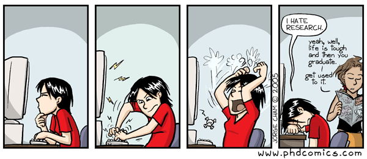

Title:   DataLad Workshop
Summary: Overview of the workshop and its scope
Authors: Adina Wagner
Date:    2022

# Overview

- :book: **What?** Two-half-day workshop on [DataLad](https://www.datalad.org/)
- :clock: **When?** 9am - 1pm (Berlin time) on Thursday, April 21st 2022 and Friday, April 22nd 2022
- :house: **Where?** Virtual (links to video-conference system will be provided via e-mail following [registration via the online form](#logistics))
- :smiley: **Who?** Everyone who would like to learn about DataLad is invited to participate. The target audience are researchers of all career stages at the [Institute of Systems Neuroscience of the University Clinic Hamburg](https://www.uke.de/english/departments-institutes/institutes/systems-neuroscience/index.html).
- :moneybag: **Costs?** The workshop is free to attend.

---

# Why would you want to join?

[Research Data Management](https://the-turing-way.netlify.app/reproducible-research/rdm.html) is a core component of good scientific practice and can help to make your work not only more reproducible and transparent - but also easier.

> Ever worked through such a directory?

> Is this metaphor fitting to a paper of yours?

> Have you ever looked like this trying to figure out how a colleagues script is supposed to work (or an old script of yourself)?

> Do you find yourself wondering how to share or publish the data and results of your recent project?

This virtual workshop, spread over two half-days, will introduce core concepts and software tools that can make your next research project easier: Version control, principles for data analysis, data publication, and collaborative scientific workflows using well-known and free services such as [GitHub](https://www.github.com) or [Gin](https://gin.g-node.org).

The workshop will be virtual and free to attend.

# Workshop Contents

The workshop will center around [DataLad](https://www.datalad.org/), an open source software tool for data versioning, data management and data publication that builds up on the industry standard [Git](https://git-scm.com/) and [git-annex](https://git-annex.branchable.com/).

Beyond introducing its functionality, we will cover useful core concepts for good research data management and reproducible, open science:
Version control for code and data, productive usage of services such as GitHub and Gin, provenance capture for reproducible analysis, organizational principles for data analysis, and workflows and services for data publication and collaboration - in conjunction with demonstrating readily-applicable workflows or examples.

This workshop can be interesting for you if you have always wanted to get going with version control, are curious to find out when and how to use DataLad, or want see real-world workflows for reproducible science.

# Logistics

### Location, date and time

The workshop will take place virtually in two half-days, from 9am to 1pm (Berlin time) on Thursday, 21st of April, and Friday, 22nd of April.
Small breaks will be provided.
Materials and recordings will be made available publicly after the workshop.

### Registration

Attendance is free, but a registration is required.

:arrow_right: **To register for the workshop, please fill out [this online form](https://forms.gle/3UKayKhS3NbH2K8w8).** It also includes a short survey to help to better prepare for audience of the workshop.

Your e-mail address will be used to send out further information as well as log in details to the virtual meeting.
Your data will be not be stored beyond the workshop, and is only used for workshop coordination.

In case of any questions about the registration, please write an e-mail to [adina.wagner@t-online.de](mailto:adina.wagner@t-online.de).

### Preparation

We plan to provide browser-based access to a Jupyter Lab instance for every participant, but you can also use your own computer. 
**Participants planning to make use of the Jupyter Lab instance do not need to prepare in advance at this point.**

We ask participants that want to use their own computer to prepare by installing and testing all required software prior to the workshop, and reach out early in advance to the [instructors](#instructors) if they require help. As the workshop is virtual, trouble-shooting during the workshop is only possible in a limited form.
All required preparations can be found in the section [Preparations for participants](content/getting_started.md).

### Code of Conduct

We ask all participants to adhere to a code of conduct for the virtual meeting.
It can be found in the section [Code of Conduct](coc.md).

### Questions

Do you have questions or are missing information on this website? Here are your options:

1. Please check out the [Frequently Asked Questions (FAQ)](FAQ.md) which might already provide an answer to your question.
2. Please open a [new Issue on GitHub](https://github.com/adswa/dl-workshop). We will then update the website accordingly with an answer. Please note, that the GitHub issues are public.
3. Write an e-mail to [adina.wagner@t-online.de](mailto:adina.wagner@t-online.de).

# Instructors

|  **Adina Wagner** | Personal website and contact details:  [adina-wagner.com](https://adina-wagner.com)      |
| --------------------------------------------------------------------------------- | --------------------- |
| Adina is a doctoral researcher in the [Psychoinformatics Lab](https://www.psychoinformatics.de/) at the [INM-7, Research Centre Jülich](https://www.fz-juelich.de/inm/inm-7/DE/Home/home_node.html). She is a part of the [DataLad](https://datalad.org) Team with a leading role in documentation, teaching, and outreach, and a 2020/21 [ReproNim/INCF Fellow](https://www.repronim.org/fellowship.html). | |

| **Michał Szczepanik** | Personal website and contact details: [mslw.github.io/](https://mslw.github.io/)       |
| --------------------------------------------------------------------------------- | --------------------- |
|Michał is a Neuroinformatician by training and by heart. He practiced fMRI for his PhD at the Nencki Institute of Experimental Biology in Warsaw before moving to Jülich into the [Psychoinformatics Lab](https://www.psychoinformatics.de/) at the [INM-7, Research Centre Jülich](https://www.fz-juelich.de/inm/inm-7/DE/Home/home_node.html) to work on research data infrastructure. | |

### Image credits

- PHD Comics: [phdcomics.com/comics/archive.php?comicid=545](http://phdcomics.com/comics/archive.php?comicid=545), [phdcomics.com/comics/archive.php?comicid=1323](http://phdcomics.com/comics/archive.php?comicid=1323)
- Frontend-Backend Comic: adapted from [dribbble.com/shots/3090048-Front-end-vs-Back-end](https://dribbble.com/shots/3090048-Front-end-vs-Back-end)
- Data publication: [https://www.socialsciencespace.com/wp-content/uploads/625px-To_deposit_or_not_to_deposit_that_is_the_question_-_journal.pbio_.1001779.g001.png](https://www.socialsciencespace.com/wp-content/uploads/625px-To_deposit_or_not_to_deposit_that_is_the_question_-_journal.pbio_.1001779.g001.png)